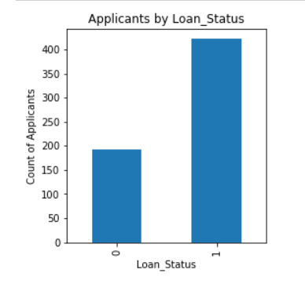
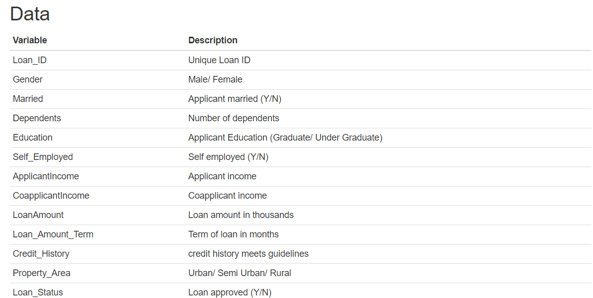
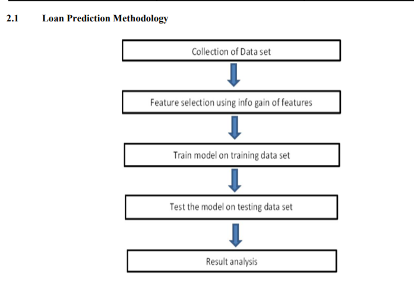

# Predicting Loan Grades with Neural Network: A Machine Learning Pipeline 

### The Problem Domain
Dream Housing Finance company deals in all home loans. They have presence across all urban, semi urban and rural areas. Customer first apply for home loan, after that company validates the customer eligibility for loan.

Company wants to automate the loan eligibility process (real time) based on customer detail provided while filling online application form. These details are Gender, Marital Status, Education, Number of Dependents,Applicant Income, Co-Applicant Income, Loan Amount, Credit History and others. 

### Challenges Faced:
Imbalanced Class Distribution- This is a scenario where the number of observations belonging to one class is significantly lower than those belonging to the other classes.While trying to resolve specific business challenges with imbalanced data sets, the classifiers produced by standard machine learning algorithms might not give accurate results. 

#### Disclaimer: 
Looking at the problem statement, it is silly that one would try to automate decision based on replication of pasts decisions instead of optimizing for business result - minimizing loan default or fraud rate. Well, but the objective here is to play around with Machine Learning and practice Data munging with Python.
The interesting problems an investigator might face with this dataset include
* Practical and usable cross-validation strategy.
* Choosing evaluation metric for the dataset and the problem being solved.
* Handling missing data

### Data
The problem was hosted for Data hack Contest in Analytics Vidhya. The dataset can be downloaded from the challenge page or from the direct link to the same dataset [train data](traindata.csv) and [test data](testdata.csv). Evaluation Metric is accuracy i.e. percentage of loan approval that we correctly predict.

### Required libraries

This notebook uses several Python packages that come standard with the Anaconda Python distribution. The primary libraries that is used here are:
*	`NumPy`: Provides a fast numerical array structure and helper functions.
*	`Pandas`: Provides a DataFrame structure to store data in memory and work with it easily and efficiently.
*	`Scikit-learn`: The essential Machine Learning package in Python.
*	`Keras` :A high-level neural networks API, written in Python and capable of running on top of TensorFlow, enabling fast experimentation.
*	`Matplotlib`: Basic plotting library in Python; most other Python plotting libraries are built on top of it.

To make sure we have all of the packages needed, install them with conda:
`conda install numpy pandas scikit-learn matplotlib keras` 

### Loan Prediction Methodology
  

### Possible Algorithms:
* Random Forest
* Support Vector machine (SVM)
* Neural Network- Tensor Flow

